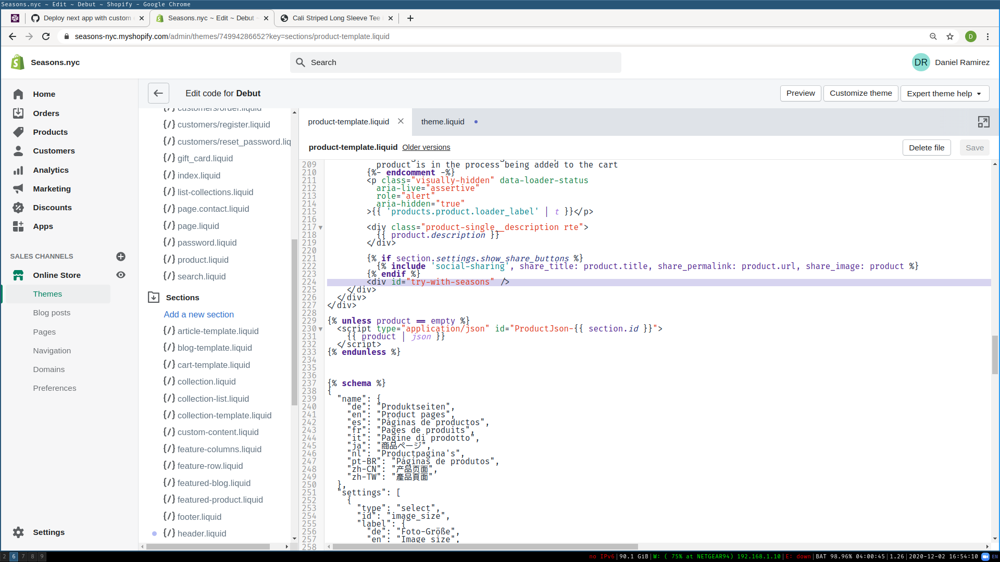
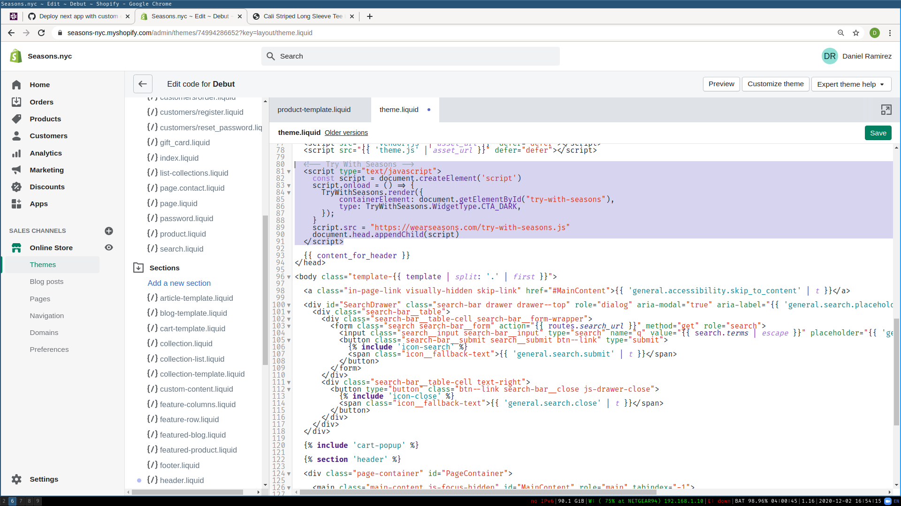
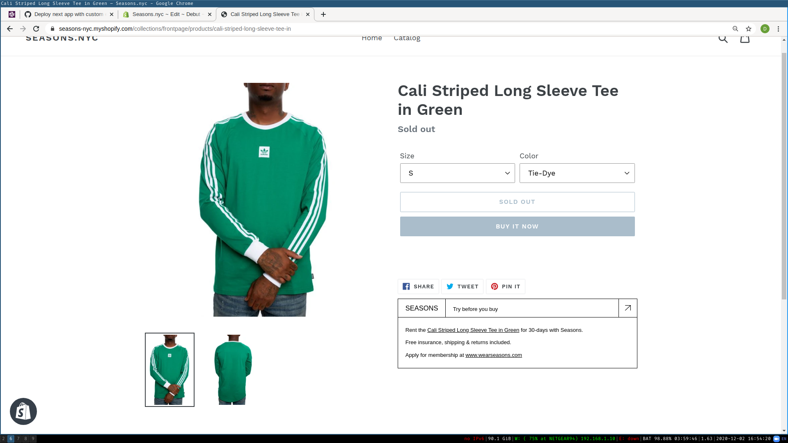

# Try With Seasons

try-with-seasons.js is a script that renders a Seasons widget on third-party brand partner site product pages to prompt users to try the product on Seasons.

## Usage

You can include the widget as a script tag in your html, or via npm. Included below are some examples of including as a script tag.

### Manual

Include the script within the third-party site HTML:

```html
<script type="text/javascript">
  const script = document.createElement("script");
  script.onload = () => {
    TryWithSeasons.render({
      containerElement: document.getElementById("try-with-seasons"),
      type: TryWithSeasons.WidgetType.CTA_DARK,
    });
  };
  script.src = "https://wearseasons.com/try-with-seasons.js";
  document.head.appendChild(script);
</script>
```

A variety of widget types are available for rendering: [WidgetType](./src/types.ts)

Optionally, an object of type `ProductDetails` may be passed to `TryWithSeasons.render`. If it is not included, product details are resolved according to the structured data included within the HTML.

If product details can not be resolved, or if the corresponding product can not be found on Seasons or is not currently available, nothing is rendered.

### Shopify

Right now, Shopify support requires manual integration into the site theme. As an example, we can walkthrough including the script into the demo [Seasons Shopify](https://seasons-nyc.myshopify.com/admin).

1. Navigate to the [Theme code editor](https://seasons-nyc.myshopify.com/admin/themes/74994286652), found by looking in the left-hand navigation, "SALES CHANNELS" -> "Online Store" -> "Themes" -> "Actions" -> "Edit code"
2. Within `Templates/product-template.liquid`, add a `<div />` that will serve as the `containerElement` for the widget:



3. Within `Layout/theme.liquid`, add a script tag to load in and render the desired widget:



4. Assuming you did everything correctly, your Shopify storefront should look like the following:



### Seasons Metadata

Seasons may need to update product metadata in order to establish the "link" between internal and external products. If you install the script correctly but do not see the widget render, contact Seasons about updating the metadata.
